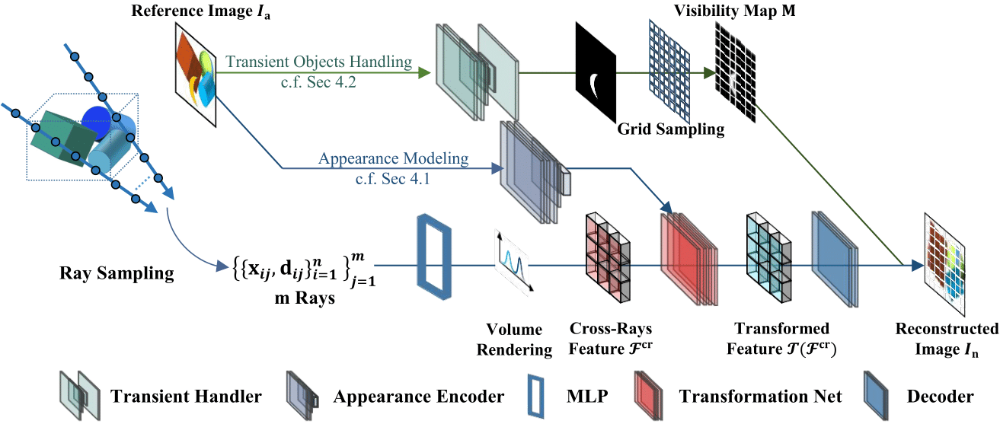

<!-- PROJECT LOGO -->

<p align="center">

  <h1 align="center">CR-NeRF: Cross-Ray Neural Radiance Fields for Novel-view Synthesis from Unconstrained Image Collections</h1>
  <p align="center">
    <strong>Yifan Yang</strong></a>
    ·
    <strong>Shuhai Zhang</strong></a>
    ·
    <strong>Zixiong Huang</strong></a>
    ·
    <strong>Yubing Zhang</strong></a>
    .
    <strong>Mingkui Tan</strong></a>
  </p>
  <h2 align="center">ICCV 2023 Oral</h2>

  <p align="center">
  <br>
    <a href='https://arxiv.org/abs/2307.08093'>
      
    </a>
  </p>
</p>

<!-- TABLE OF CONTENTS -->
<details open="open" style='padding: 10px; border-radius:5px 30px 30px 5px; border-style: solid; border-width: 1px;'>
  <summary>Table of Contents</summary>
  <ol>
    <li>
      <a href="#introduction-to-cr-nerf">Introduction to CR-NeRF</a>
    </li>
    <li>
      <a href="#video-demo">Video Demo</a>
    </li>
    <li>
      <a href="#instructions">Instructions</a>
    </li>
    <li>
      <a href="#running-demo">Running Demo</a>
    </li>
    <li>
    <a href="#training-and-testing">Training and testing</a>
    </li>
    <li>
      <a href="#citation">Citation</a>
    </li>
  </ol>
</details>
<br />
<br />

<br>


## Introduction-to-CR-NeRF 
|                             |
| :----------------------------------------------------------: |
|       _Pipeline of CR-NeRF_       |        
- If you want to **Train & Evaluate**, please check [dataset.md](./docs/dataset.md) to prepare dataset, see
<a href="#training-and-testing">Training and testing</a> to train and benchmark CR-NeRF using Brandenburg Gate tainingset

- During evaluation, given:
  - A RGB image of a desired image style
  - Camera position

with our CR-NeRF You will get:
  - image:
    - with the same camera position as the given one
    - with the same image style as the given image

For more details of our CR-NeRF, see architecture visualization in our [encoder](images/architecture/encoder.pdf), [transformation net](images/architecture/transformation_net.pdf), and [decoder](images/architecture/decoder.pdf)

<br/>


<br>

## Video-Demo

### Appearance Hallucination

---

#### Trevi Fountain

[](https://youtu.be/H2GcYWkLT4Q "")

#### Brandenburg Gate

[](https://youtu.be/2GDLd55-6_w "")

### Cross-Appearance Hallucination

---
#### From Trevi Fountain to Brandenburg Gate

[](https://youtu.be/CiDV4_0UHOE "")

#### From Brandenburg Gate to Trevi Fountain

[](https://youtu.be/efGp77IK2Uo "")

### Appearance Hallucination
---

[](https://youtu.be/WnHQJv-n4no "")

### Comparison with NeRF-W
---
[](https://youtu.be/qblThzrP70Y "")


<br/>


<br>

## Instructions

- See [docs/installation.md](docs/installation.md) to install all the required packages and setup the models
- See [docs/dataset.md](docs/dataset.md) to prepare the in-the-wild datasets
- See <a href="#training-and-testing">Training and testing</a> to train and benchmark CR-NeRF using Brandenburg Gate tainingset

<br/>


<br>


<br>


## Running Demo
Download trained checkpoints from:
[google drive](https://drive.google.com/drive/folders/1yuV8_FtqCPtDN1g8t_4kZaKwoXbTuqZe?usp=sharing)
or 
[Baidu drive](链接：https://pan.baidu.com/s/1BD29dnHn0vQHWyazgexIXQ?pwd=z6wd)
password: z6wd 

**If you want video demo**
```bash
#Set $scene_name and $save_dir1 and cuda devices in command/get_video_demo.sh
bash command/get_video_demo.sh
```
The rendered video (in .gif format) will be in path "{$save_dir1}/appearance_modification/{$scene_name}"

**If you want images for evaluating metrics**
```bash
bash command/get_rendered_images.sh
```
The rendered images will be in path "{$save_dir1}/{$exp_name1}"

## Training and testing

```bash
#Set experiment name and cuda devices in train.sh 
bash command/train.sh
#Set the experiment name to match the training name, and set cuda devices in test.sh 
bash command/test.sh
```

<br/>
<br/>

## Citation

```bibtex
@article{yang2023cross,
  title={Cross-Ray Neural Radiance Fields for Novel-view Synthesis from Unconstrained Image Collections},
  author={Yang, Yifan and Zhang, Shuhai and Huang, Zixiong and Zhang, Yubing and Tan, Mingkui},
  journal={arXiv preprint arXiv:2307.08093},
  year={2023}
}
```

## Acknowledgments

We thank [Dong Liu](https://github.com/AnderDong)'s help in making the video demo

Here are some great resources we benefit from:

- [NeRF-W](https://github.com/kwea123/nerf_pl.git) 
- [Ha-NeRF](https://github.com/rover-xingyu/Ha-NeRF.git)
- [LinearStyleTransfer](https://github.com/sunshineatnoon/LinearStyleTransfer.git)
- [CGNet](https://github.com/wutianyiRosun/CGNet.git)

<br>

## License

By downloading and using the code and model you agree to the terms in the [LICENSE](LICENSE).


